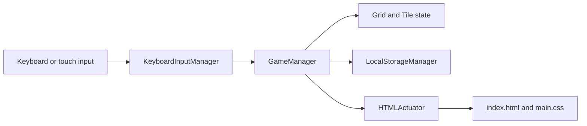

# Architecture

This is a static browser application. `index.html` loads the JavaScript files in dependency order and starts a four-by-four game.

## Main Responsibilities

- `js/application.js` starts the game.
- `js/keyboard_input_manager.js` turns keyboard and touch gestures into game events.
- `js/game_manager.js` owns moves, merging, score, win state, and loss state.
- `js/grid.js` and `js/tile.js` model the board.
- `js/local_storage_manager.js` stores the current game and best score.
- `js/html_actuator.js` renders tiles, scores, and game messages.
- `style/main.css` keeps the original game styles; `style/jaipur.css` is the self-contained workshop theme override.

## Change Seams

- Winning-target behaviour belongs in game configuration and `GameManager`.
- Visible target text belongs in a small page controller rather than duplicated static copy.
- Tile thresholds used only for presentation belong in the actuator metadata.
- Jaipur colours and motifs belong in the standalone theme override so the original game styles remain reusable.
