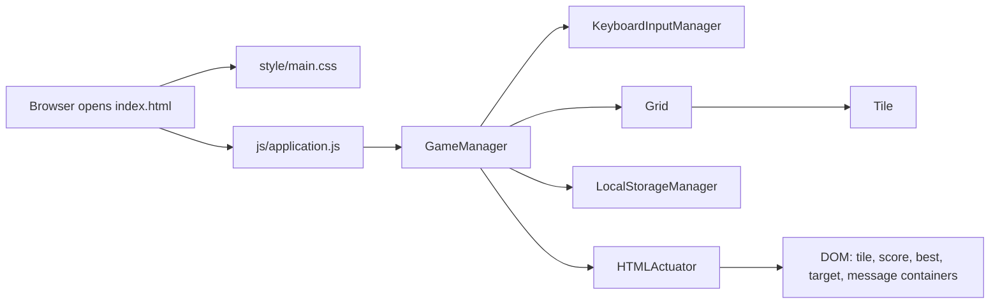
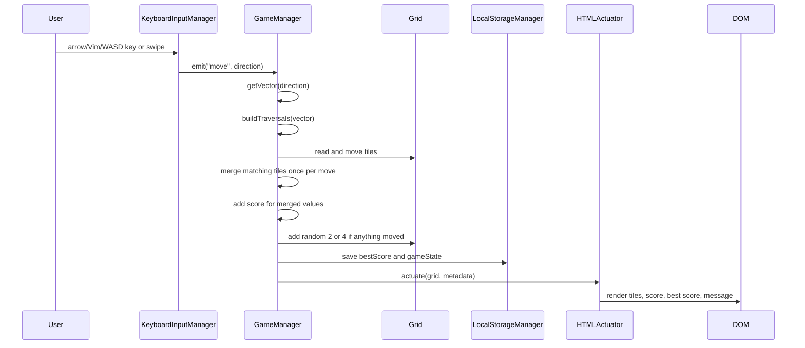
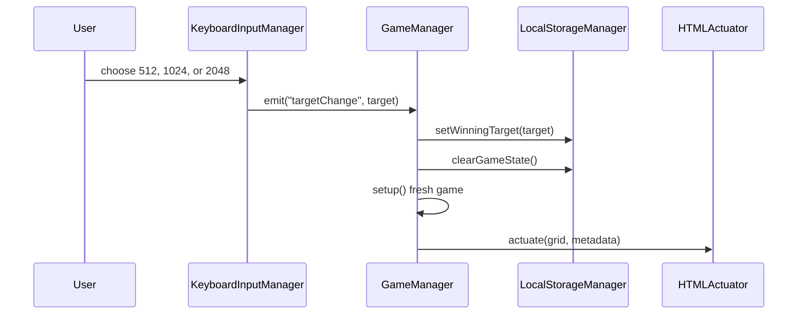
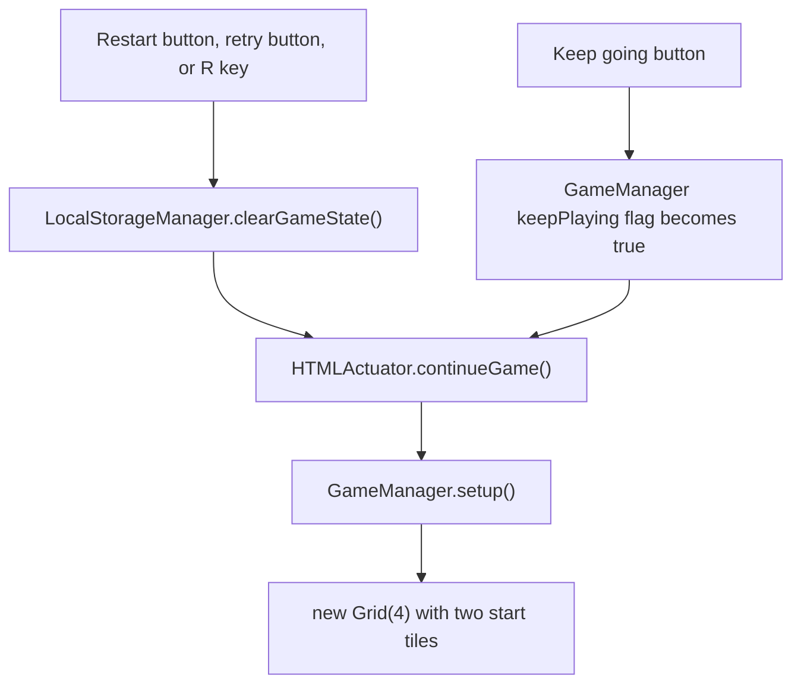
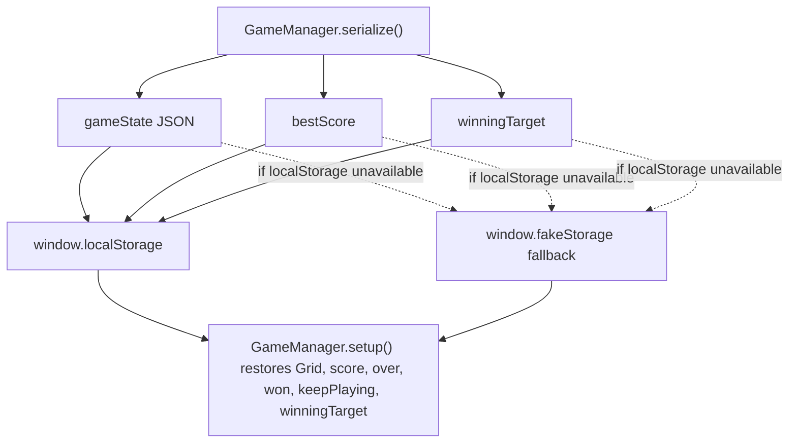
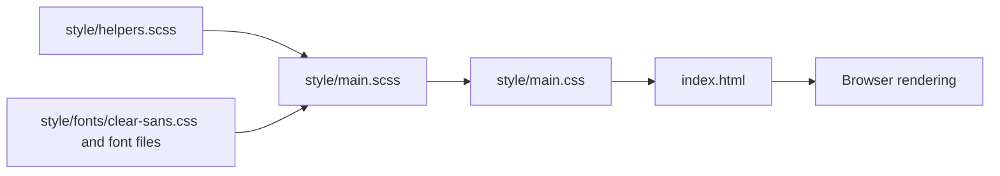
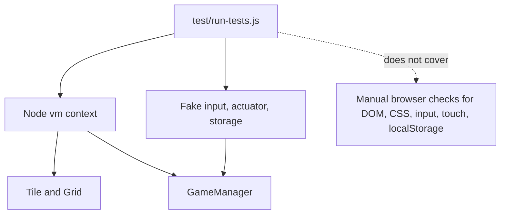

# Visual guide

Use this guide to get oriented quickly. The diagrams show the static app
structure, how a user action moves through the code, where state is stored, and
where tests and styling live.

## Main structure

```text
2048 repo
├── index.html
│   ├── board markup
│   ├── score, target, and message containers
│   └── script load order
├── js/
│   ├── application.js              starts GameManager(4, ...)
│   ├── game_manager.js             gameplay rules, target, state transitions
│   ├── grid.js                     cells[x][y] board model
│   ├── tile.js                     tile model and serialization
│   ├── keyboard_input_manager.js   keyboard, button, target, swipe events
│   ├── html_actuator.js            DOM rendering
│   ├── local_storage_manager.js    best score, target, saved game state
│   └── *_polyfill.js               browser compatibility helpers
├── style/
│   ├── main.scss                   source styles
│   ├── helpers.scss                Sass mixins and helpers
│   ├── main.css                    generated CSS loaded by index.html
│   └── fonts/                      Clear Sans assets
├── test/
│   └── run-tests.js                dependency-free Node baseline tests
├── docs/
│   ├── setup.md
│   ├── architecture.md
│   ├── testing.md
│   ├── safe-changes.md
│   └── visual-guide.md
├── Rakefile                        appcache helper for gh-pages branch
├── README.md
└── CONTRIBUTING.md
```

## Runtime map



`index.html` loads plain scripts, so load order matters. The model classes and
adapters are globals by the time `js/application.js` constructs the manager.

## User action flow

This is the path for a move from a key press or swipe.



The direction values are verified in `js/game_manager.js` and
`js/keyboard_input_manager.js`: `0` is up, `1` is right, `2` is down, and `3` is
left.

Target changes follow the same input-manager pattern:



## Restart and keep-playing flow



Restart clears saved game state and starts fresh. Keep-playing only clears the
win message and lets the current game continue beyond the selected target.

## State storage



`LocalStorageManager` uses three keys: `bestScore`, `gameState`, and
`winningTarget`. `gameState` is JSON from `GameManager.serialize()`, including
the serialized grid, score, `over`, `won`, `keepPlaying`, and `winningTarget`.

## Board model

```text
Grid cells are addressed as cells[x][y]

          y=0       y=1       y=2       y=3
       +---------+---------+---------+---------+
x=0    | cell    | cell    | cell    | cell    |
       +---------+---------+---------+---------+
x=1    | cell    | cell    | cell    | cell    |
       +---------+---------+---------+---------+
x=2    | cell    | cell    | cell    | cell    |
       +---------+---------+---------+---------+
x=3    | cell    | cell    | cell    | cell    |
       +---------+---------+---------+---------+
```

This is column-first storage, not row-first storage. A tile stores its own `x`
and `y`, and `Grid.insertTile(tile)` places it at `cells[tile.x][tile.y]`.

## Styling and assets



`style/main.css` is the file the browser loads. Existing contribution guidance
says to edit Sass sources in `style/` and regenerate CSS instead of hand-editing
`style/main.css` alone.

## Test boundary



The baseline tests intentionally avoid dependencies. They verify existing core
behavior without a browser: tile serialization, grid operations, restored grid
state, start tiles, target storage, target-specific winning, merging and score
updates, and no-op moves.
